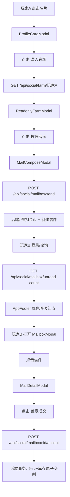

# MVP 8.0: 互访窥探与场外暗池 (Voyeurism & OTC Mailbox)

## 一、产品心智模型

```
公开市场（阳谋）         场外暗池（阴谋）
─────────────────────────────────────
盘口深度 + 红绿价格      私密契约 + 一对一谈判
拼算力 / 手速            拼人脉 / 心机
所有人可见                只有收发双方知晓
```

核心原则：
- **不引入 WebSocket / 实时 IM** — 保持 REST 异步邮件流
- **不破坏现有经济循环** — OTC 只是补充通道，不替代公开市场
- **视觉仪式感 > 功能复杂度** — 火漆信封、冷色调潜入、红色呼吸光晕

---

## 二、数据模型 (`schema.prisma`)

```prisma
// ===== MVP 8.0: 信箱 / 场外暗池 =====
model Mailbox {
  id          Int      @id @default(autoincrement())
  senderId    Int      @map("sender_id")
  receiverId  Int      @map("receiver_id")
  content     String   @default("")              // 留言文本
  // OTC 契约字段（可选，全为 null 则为纯留言）
  offerItem   String?  @map("offer_item")         // 想买的物品 ID
  offerAmount Int?     @map("offer_amount")       // 想买的数量
  offerPrice  Int?     @map("offer_price")        // 一口价总价（金币）
  status      String   @default("unread")         // unread | read | accepted | declined
  createdAt   DateTime @default(now()) @map("created_at")
  updatedAt   DateTime @updatedAt @map("updated_at")

  sender   User @relation("SentMails", fields: [senderId], references: [userId])
  receiver User @relation("ReceivedMails", fields: [receiverId], references: [userId])

  @@index([receiverId, status])   // 查询收件箱：按收件人 + 状态
  @@index([senderId])             // 查询发件箱
  @@map("mailbox")
}
```

**User 模型新增关联：**
```prisma
model User {
  // ... 现有字段
  sentMail     Mailbox[] @relation("SentMails")
  receivedMail Mailbox[] @relation("ReceivedMails")
}
```

---

## 三、后端 API 设计

所有路由挂载到 `/api/social`（与现有名片/房产升级共用前缀）。

### 3.1 互访窥探

| 方法 | 路径 | 说明 |
|------|------|------|
| `GET` | `/api/social/farm/:username` | 获取目标玩家的只读农场数据 |

**响应结构：**
```json
{
  "code": 0,
  "data": {
    "user_id": 1,
    "nickname": "赛博地主",
    "housing": { "tier": 5, "name": "郊区红砖平房", "emoji": "🏡" },
    "plots": [
      { "plot_id": 1, "status": "growing", "crop": "wheat", "remaining_seconds": 420, "crop_name": "小麦", "crop_emoji": "🌾" },
      { "plot_id": 2, "status": "idle", "crop": null, "remaining_seconds": 0, "crop_name": null, "crop_emoji": null }
    ]
  }
}
```

**关键设计：** 只返回 `status` / `crop` / `remaining_seconds`，不返回 `planted_at`（精确时间戳暴露太多信息）。地块按 `plot_id` 排序。

### 3.2 信箱 CRUD

| 方法 | 路径 | 说明 |
|------|------|------|
| `GET` | `/api/social/mailbox` | 获取当前玩家的收件箱（按时间倒序） |
| `GET` | `/api/social/mailbox/sent` | 获取当前玩家的发件箱 |
| `GET` | `/api/social/mailbox/unread-count` | 获取未读邮件数量（用于红点） |
| `POST` | `/api/social/mailbox/send` | 发送信件（可附带 OTC 契约） |
| `POST` | `/api/social/mailbox/:id/read` | 标记为已读 |
| `POST` | `/api/social/mailbox/:id/accept` | 接受 OTC 契约（原子交割） |
| `POST` | `/api/social/mailbox/:id/decline` | 拒绝 OTC 契约 |

### 3.3 发信请求体 (`POST /api/social/mailbox/send`)

```json
{
  "receiver_username": "目标玩家名",
  "content": "嘿BOY，私下卖点虫草？",
  "offer_item": "cordyceps",
  "offer_amount": 50,
  "offer_price": 10000
}
```

**后端逻辑：**
1. 查找 `receiver_username` 对应的 `userId`
2. 如果包含 OTC 字段，**预扣发件人金币**（冻结到 `offer_price` 金额）
3. 创建 `Mailbox` 记录，`status: 'unread'`
4. 如果金币不足，返回 400

### 3.4 接受契约 (`POST /api/social/mailbox/:id/accept`)

**原子事务（最关键）：**
```typescript
await prisma.$transaction(async (tx) => {
  // 1. 读取信件，校验 status === 'unread'
  const mail = await tx.mailbox.findUnique({ where: { id } })
  if (!mail || mail.status !== 'unread') throw new Error('信件已处理')

  // 2. 校验发件人金币是否仍足够（可能被其他消费耗尽）
  const sender = await tx.user.findUnique({ where: { userId: mail.senderId } })
  if (sender.gold < mail.offerPrice) throw new Error('发件人金币不足')

  // 3. 校验收件人是否有足够库存
  const receiverInv = await tx.inventory.findUnique({
    where: { userId_item: { userId: mail.receiverId, item: mail.offerItem } }
  })
  if (!receiverInv || receiverInv.amount < mail.offerAmount) throw new Error('库存不足')

  // 4. 扣发件人金币 + 加收件人金币
  await tx.user.update({ where: { userId: mail.senderId }, data: { gold: { decrement: mail.offerPrice } } })
  await tx.user.update({ where: { userId: mail.receiverId }, data: { gold: { increment: mail.offerPrice } } })

  // 5. 扣收件人库存 + 加发件人库存
  await tx.inventory.update({
    where: { userId_item: { userId: mail.receiverId, item: mail.offerItem } },
    data: { amount: { decrement: mail.offerAmount } }
  })
  await tx.inventory.update({
    where: { userId_item: { userId: mail.senderId, item: mail.offerItem } },
    data: { amount: { increment: mail.offerAmount } }
  })

  // 6. 标记信件为 accepted
  await tx.mailbox.update({ where: { id }, data: { status: 'accepted' } })
})
```

### 3.5 拒绝契约 (`POST /api/social/mailbox/:id/decline`)

```typescript
// 1. 读取信件
// 2. 如果包含 OTC 字段，解冻发件人金币（退还预扣）
// 3. 标记 status: 'declined'
```

---

## 四、前端组件树

```
AppFooter.vue
  └─ 📬 信箱入口（右下角邮筒图标 + 红色呼吸红点）

UserView.vue (仓储中心)
  └─ 📬 信箱入口（页面右上角邮筒图标 + 未读计数）

ProfileCardModal.vue (资产名片)
  └─ [ 潜入农场 ] 按钮 → 打开 ReadonlyFarmModal.vue

ReadonlyFarmModal.vue (只读农场窥探)
  ├─ 冷色调滤镜（全屏蒙层）
  ├─ 目标玩家房产展示（emoji + 名称 + 阶级）
  ├─ 地块网格（只读：显示作物 emoji + 倒计时，禁用点击）
  └─ [ 投递密函 ] 按钮 → 打开 MailComposeModal.vue

MailComposeModal.vue (写密函)
  ├─ 收件人（自动填入）
  ├─ 留言文本域
  ├─ OTC 契约区（可选：物品选择 + 数量 + 一口价）
  └─ [ 发送 ] 按钮

MailboxModal.vue (信箱列表)
  ├─ 收件箱 / 发件箱 Tab 切换
  ├─ 信件卡片列表（发件人头像 + 摘要 + 状态标签）
  └─ 点击信件 → 打开 MailDetailModal.vue

MailDetailModal.vue (信件详情)
  ├─ 牛皮纸 + 火漆印章 UI
  ├─ 发件人信息 + 留言内容
  ├─ OTC 契约卡片（物品 + 数量 + 总价）
  ├─ [ 盖章成交 ] / [ 拒绝 ] 按钮（仅收件人可见）
  └─ 状态标签（已读/已成交/已拒绝）
```

---

## 五、数据流图



---

## 六、轮询策略（非 WebSocket）

| 场景 | 策略 | 间隔 |
|------|------|------|
| 未读红点 | `setInterval` 轮询 `/unread-count` | 15 秒 |
| 信箱列表 | 手动刷新（进入信箱时拉取） | 按需 |
| 信件详情 | 手动刷新 | 按需 |

**实现：** 在 [`AppFooter.vue`](client/src/components/AppFooter.vue) 和 [`UserView.vue`](client/src/views/UserView.vue) 中挂载 `onMounted` / `onUnmounted` 启动/停止轮询。

---

## 七、文件变更清单

### 新增文件

| 文件 | 说明 |
|------|------|
| [`server/src/routes/mailbox.ts`](server/src/routes/mailbox.ts) | 信箱 CRUD + OTC 交割 API |
| [`client/src/components/MailboxModal.vue`](client/src/components/MailboxModal.vue) | 信箱列表（收件/发件 Tab） |
| [`client/src/components/MailDetailModal.vue`](client/src/components/MailDetailModal.vue) | 信件详情（火漆信封 UI + OTC 按钮） |
| [`client/src/components/MailComposeModal.vue`](client/src/components/MailComposeModal.vue) | 写密函（文本 + OTC 契约） |
| [`client/src/components/ReadonlyFarmModal.vue`](client/src/components/ReadonlyFarmModal.vue) | 只读农场窥探（冷色调 + 禁用操作） |
| [`client/src/stores/mailbox.ts`](client/src/stores/mailbox.ts) | 信箱 Pinia store（状态 + 轮询） |

### 修改文件

| 文件 | 变更 |
|------|------|
| [`server/prisma/schema.prisma`](server/prisma/schema.prisma) | 新增 `Mailbox` 模型 + User 关联 |
| [`server/src/index.ts`](server/src/index.ts) | 挂载 `mailboxRoutes` |
| [`client/src/types/index.ts`](client/src/types/index.ts) | 新增 `MailboxMessage`, `MailboxListData`, `SendMailRequest` 等类型 |
| [`client/src/api/index.ts`](client/src/api/index.ts) | 新增信箱 API 调用函数 |
| [`client/src/components/AppFooter.vue`](client/src/components/AppFooter.vue) | 右下角邮筒图标 + 红色呼吸红点 |
| [`client/src/components/ProfileCardModal.vue`](client/src/components/ProfileCardModal.vue) | 新增 `[ 潜入农场 ]` 按钮 |
| [`client/src/views/UserView.vue`](client/src/views/UserView.vue) | 页面右上角信箱入口 + 未读计数 |

---

## 八、UI/UX 规范

### 8.1 红色呼吸红点

```css
/* main.css */
@keyframes breathe {
  0%, 100% { box-shadow: 0 0 4px 2px rgba(239, 68, 68, 0.3); }
  50%      { box-shadow: 0 0 8px 4px rgba(239, 68, 68, 0.7); }
}
.mailbox-red-dot {
  width: 10px; height: 10px;
  background: #ef4444;
  border-radius: 50%;
  animation: breathe 2s ease-in-out infinite;
}
```

### 8.2 冷色调窥探滤镜

```css
/* ReadonlyFarmModal.vue scoped */
.readonly-overlay {
  filter: hue-rotate(200deg) saturate(0.6) brightness(0.9);
  pointer-events: none;  /* 禁用所有点击 */
}
```

### 8.3 火漆信封卡片

- 背景色：`bg-amber-900/20` 暖黄牛皮纸色调
- 边框：`border-amber-700/30`
- 火漆印章：使用 `🔴` emoji 或 CSS 圆形渐变模拟
- 字体：`font-serif` 衬线字体增加复古感

---

## 九、执行顺序

1. **Prisma Schema** → `db push` 同步数据库
2. **后端 API** → `mailbox.ts`（CRUD + OTC 原子交割）
3. **类型定义** → `types/index.ts` 新增接口
4. **API 层** → `api/index.ts` 新增调用函数
5. **Store** → `stores/mailbox.ts`（状态管理 + 轮询）
6. **ReadonlyFarmModal** → 只读农场窥探组件
7. **MailComposeModal** → 写密函组件
8. **MailDetailModal** → 信件详情 + OTC 交割按钮
9. **MailboxModal** → 信箱列表
10. **ProfileCardModal** → 添加 `[ 潜入农场 ]` 按钮
11. **AppFooter + UserView** → 邮筒入口 + 红色呼吸红点
12. **编译验证 + 推送**
